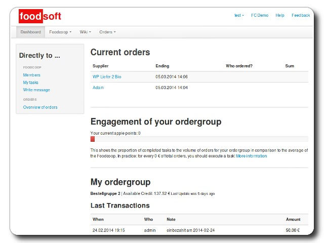

<!--
N.B.: This README was automatically generated by https://github.com/YunoHost/apps/tree/master/tools/README-generator
It shall NOT be edited by hand.
-->

# Foodsoft for YunoHost

[](https://dash.yunohost.org/appci/app/foodsoft)    
[](https://install-app.yunohost.org/?app=foodsoft)

*[Lire ce readme en français.](./README_fr.md)*

> *This package allows you to install Foodsoft quickly and simply on a YunoHost server.
If you don't have YunoHost, please consult [the guide](https://yunohost.org/#/install) to learn how to install it.*

## Overview

[Foodsoft](https://foodcoops.github.io/) is a web-based software to manage a non-profit food coop (product catalog, ordering, accounting, job scheduling). A food cooperative is a group of people that buy food from suppliers of their own choosing. A collective do-it-yourself supermarket. Members order their products online and collect them on a specified day. And all put in a bit of work to make that possible. Foodsoft facilitates the process.


**Shipped version:** 4.7.1.1~ynh1

**Demo:** https://foodcoops.github.io/demo/

## Screenshots



## Disclaimers / important information

## Credentials

[LDAP is not supported yet](https://github.com/foodcoops/foodsoft/issues/439). Setting an administrator password at install time is [also not supported yet](https://github.com/YunoHost-Apps/foodsoft_ynh/issues/9). However, we do support setting the administrator profile details like username, first name, last name and email. When you first log in as the administrator, you must use the default value of **secret**. You should reset this password immediately.

## Pre-installation steps

Please consider the following **before** installing:

* There are many configuration options asked at installation time. Please review the [default configuration file](https://raw.githubusercontent.com/foodcoops/foodsoft/master/config/app_config.yml.SAMPLE) for some help in learning what these are all about.

## Status

* This is a new package and quite experimental. Please test with care.
* Only the `install` and `remove` actions work. Please see [this ticket](https://github.com/YunoHost-Apps/foodsoft_ynh/issues/1) for progress on enabling the rest.
* Make sure to review issues and on-going work on [the issue tracker](https://github.com/YunoHost-Apps/foodsoft_ynh/issues)

## Configuration

* You can use the web interface to configure most things.

* Find the main application configuration at `/var/www/foodsoft/config`. Please note, any modifications of these files can be wiped on upgrade. We don't have a good solution for that right now. We aim to make most things configurable at installation time.

## Administration

* You have a number of Systemd services to manage. You can check them out with:
  * systemctl status foodsoft - the rails server managed by passenger
  * systemctl status resque - the redis task runner

## Documentation and resources

* Official app website: https://foodcoops.github.io/foodsoft-hosting
* Official admin documentation: https://foodcoops.github.io/foodsoft-hosting/
* Upstream app code repository: https://github.com/foodcoops/foodsoft
* YunoHost documentation for this app: https://yunohost.org/app_foodsoft
* Report a bug: https://github.com/YunoHost-Apps/foodsoft_ynh/issues

## Developer info

Please send your pull request to the [testing branch](https://github.com/YunoHost-Apps/foodsoft_ynh/tree/testing).

To try the testing branch, please proceed like that.
```
sudo yunohost app install https://github.com/YunoHost-Apps/foodsoft_ynh/tree/testing --debug
or
sudo yunohost app upgrade foodsoft -u https://github.com/YunoHost-Apps/foodsoft_ynh/tree/testing --debug
```

**More info regarding app packaging:** https://yunohost.org/packaging_apps