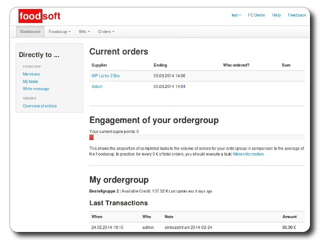

# Foodsoft pour YunoHost

[](https://dash.yunohost.org/appci/app/foodsoft)    
[](https://install-app.yunohost.org/?app=foodsoft)

*[Read this readme in english.](./README.md)*
*[Lire ce readme en français.](./README_fr.md)*

> *Ce package vous permet d'installer Foodsoft rapidement et simplement sur un serveur YunoHost.
Si vous n'avez pas YunoHost, regardez [ici](https://yunohost.org/#/install) pour savoir comment l'installer et en profiter.*

## Vue d'ensemble

[Foodsoft](https://foodcoops.github.io/) est une application web pour gérer un groupement d'achats à but non lucratif (catalogue des produits, commandes, comptes utilisateurs, assignation des tâches à accomplir). Un groupement d'achats est un groupe de personnes qui achètent de la nourriture directement aux producteurs de leur choix. Un supermaché collectif fait-maison.
Les membres peuvent commander leurs produits en ligne et les collectent le jour de la distribution.
Chaque personne fait sa part du travail pour rendre cela possible.
Foodsoft facilite le processus.


**Version incluse :** 4.7.1.1~ynh1

**Démo :** https://foodcoops.github.io/demo/

## Captures d'écran



## Avertissements / informations importantes

## Identifiants

LDAP n'est pas encore supporté. Définir un mot de passe administrateur lors de l'installation n'est pas non plus encore supporté. Cependant déinir des détails du profil administrateur comme nom d'utilisateur, nom, prénom et email sont bien supportés.
Lors de votre première connection en tant qu'administrateur vous devrez utiliser le mot de passe *secret* et le changer immédiatement après votre première connection.

## Procédure de pré-installation
Veuillez considérer ceci avant l'installation : 

- Il y a beaucoup d'options de configuration demandées lors de l'installation. Veuillez consulter le fichier de configuration par défaut pour comprendre à quoi correspond tout cela.

## Statut
Ceci est un nouveau paquet plutôt expérimental. Veuillez tester avec précaution.
Seules les action installer et désinstaller fonctionnent.Veuillez consulter (ce ticket)[https://github.com/YunoHost-Apps/foodsoft_ynh/issues/1] pour voir où ça en est pour le reste.
Assurez-vous de vérifier les problèmes et le travail en cours dans le tracker de bug.

## Documentations et ressources

* Site officiel de l'app : https://foodcoops.github.io/foodsoft-hosting
* Documentation officielle de l'admin : https://foodcoops.github.io/foodsoft-hosting/
* Dépôt de code officiel de l'app : https://github.com/foodcoops/foodsoft
* Documentation YunoHost pour cette app : https://yunohost.org/app_foodsoft
* Signaler un bug : https://github.com/YunoHost-Apps/foodsoft_ynh/issues

## Informations pour les développeurs

Merci de faire vos pull request sur la [branche testing](https://github.com/YunoHost-Apps/foodsoft_ynh/tree/testing).

Pour essayer la branche testing, procédez comme suit.
```
sudo yunohost app install https://github.com/YunoHost-Apps/foodsoft_ynh/tree/testing --debug
ou
sudo yunohost app upgrade foodsoft -u https://github.com/YunoHost-Apps/foodsoft_ynh/tree/testing --debug
```

**Plus d'infos sur le packaging d'applications :** https://yunohost.org/packaging_apps